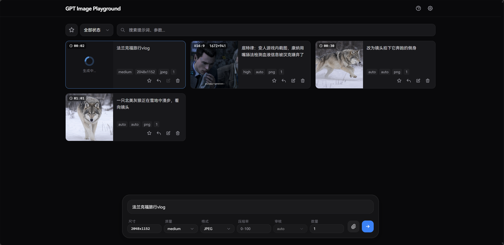
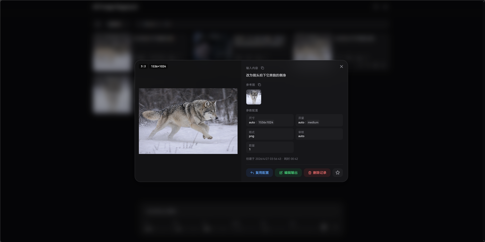
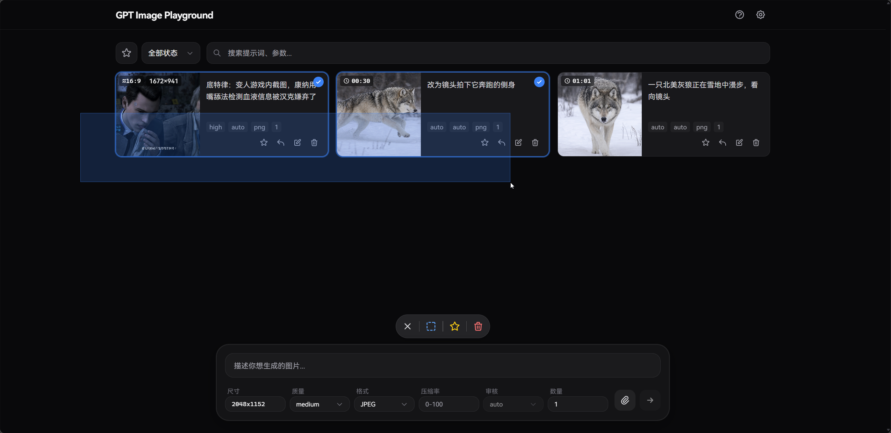
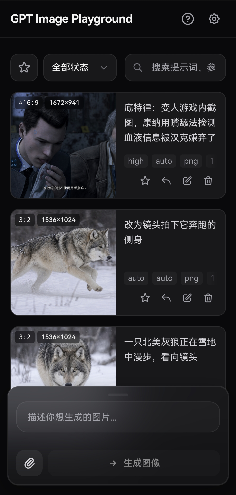
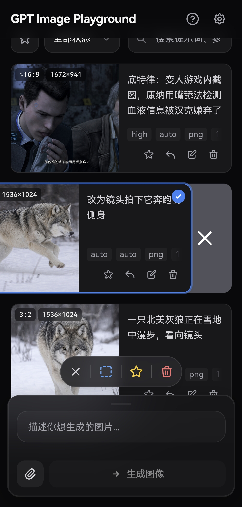

# GPT Image Playground

基于 OpenAI 图像生成接口的图片生成与编辑工具。提供简洁精美的 Web UI，支持文本生图、参考图与遮罩编辑，数据纯本地化存储，带来流畅的历史记录与参数管理体验。

> 若需调用非 HTTPS 的内网或本地 HTTP API，请使用 GitHub Pages 版本或自行部署，Vercel 部署的体验版绑定的 `.dev` 域名因安全策略通常要求接口必须为 HTTPS。

[**🌐 Vercel 在线体验**](https://gpt-image-playground.cooksleep.dev) &nbsp;|&nbsp; [**🌐 GitHub Pages 在线体验**](https://cooksleep.github.io/gpt_image_playground)

---

## 📸 界面预览

<details>
<summary><b>点击展开截图展示</b></summary>
<br>

<div align="center">
  <b>桌面端主界面</b><br>
  
</div>

<br>

<div align="center">
  <b>任务详情与实际参数</b><br>
  
</div>

<br>

<div align="center">
  <b>桌面端批量选择</b><br>
  
</div>

<br>

<div align="center">
  <b>移动端主界面</b><br>
  
</div>

<br>

<div align="center">
  <b>移动端侧滑多选</b><br>
  
</div>

</details>

---

## ✨ 核心特性

### 🎨 强大的图像生成与编辑
- **双模接口支持**：自由切换使用常规 `Images API` (`/v1/images`) 或 `Responses API` (`/v1/responses`)。
- **参考图与遮罩**：支持上传最多 16 张参考图（支持剪贴板和拖拽）。内置可视化遮罩编辑器，自动预处理以符合官方分辨率限制。
- **批量与迭代**：支持单次多图生成；一键将满意结果转为参考图，无缝开启下一轮修改。

### ⚙️ 精细化参数追踪
- **智能尺寸控制**：提供 1K/2K/4K 快速预设，自定义宽高时会自动规整至模型安全范围（16 的倍数、总像素校验等）。
- **实际参数对比**：自动提取 API 响应中真实生效的尺寸、质量、耗时以及**模型改写后的提示词**，与你的请求参数高亮对比。

### 📁 高效历史管理 (纯本地)
- **瀑布流与画廊**：历史任务自动保存，支持按状态过滤、全屏大图预览与快捷下载。
- **快捷批量操作**：桌面端支持鼠标拖拽框选、Ctrl/⌘ 连选，移动端支持顺滑侧滑多选；轻松实现批量收藏与清理。
- **极致性能与隐私**：所有记录与图片均存放在浏览器 IndexedDB 中（采用 SHA-256 去重压缩），不经过任何第三方服务器。支持一键打包导出 ZIP 备份。

### 🔌 API 兼容增强
- **模型列表**：管理员可维护多个独立模型配置，普通用户可在生成栏直接选择模型。
- **Codex 兼容模型**：模型标记为 Codex 兼容后，会禁用并省略尺寸、质量、格式、压缩率和审核参数。

---

## 🚀 部署与使用

支持多种部署与开发方式。无论使用哪种方式，你都可以预设默认的 API 节点。

<details>
<summary><strong>▲ 方式一：Vercel 一键部署 (推荐)</strong></summary>

[](https://vercel.com/new/clone?repository-url=https%3A%2F%2Fgithub.com%2FCookSleep%2Fgpt_image_playground&project-name=gpt-image-playground&repository-name=gpt-image-playground)

点击上方按钮导入仓库即可，Vercel 会自动执行构建并部署静态文件。

**配置默认 API URL**：在 Vercel 项目的 **Settings → Environment Variables** 中添加 `VITE_DEFAULT_API_URL`（如 `https://api.openai.com/v1`），然后重新部署即可生效。

**配置自动更新**：

本项目已在 `vercel.json` 中关闭了默认的自动部署。若需在同步 GitHub 上游代码后自动更新 Vercel 部署：

1. 在 Vercel 项目设置 **Settings -> Git** 的 **Deploy Hooks** 中创建一个名为 `Release` 的 Hook（Branch 填 `main`）并复制生成的 URL。
2. 在你 Fork 的 GitHub 仓库设置 **Settings -> Secrets and variables -> Actions** 中，新建 Secret `VERCEL_DEPLOY_HOOK`，填入刚才的 URL。

此后，每次在 GitHub 点击 **Sync fork** 同步上游，都会自动触发 Vercel 构建部署最新版。

</details>

<details>
<summary><strong>🐳 方式二：Docker 部署</strong></summary>

官方镜像已发布至 GitHub Container Registry。Docker 部署支持在运行时注入默认配置。

**环境变量说明：**

- `DEFAULT_API_URL`：设置页面上默认显示的 API 地址。
- `API_PROXY_URL`：配置内置代理实际转发到的目标 API 地址（仅开启代理时有效）。
- `ENABLE_API_PROXY`：设为 `true` 开启容器内置 Nginx 同源代理，用于解决浏览器跨域（CORS）限制。开启后，浏览器将请求同源的 `/api-proxy/`，再由 Nginx 转发至 `API_PROXY_URL`。
- `HOST` / `PORT`：指定容器内 Nginx 监听的地址和端口（默认 `0.0.0.0:80`）。

> ⚠️ **安全警告**：开启 API 代理后，任何人都能将你的服务器作为代理来请求目标 API。建议仅在有访问控制（如 IP 白名单）或本地网络中开启。

> 💡 **兼容迁移**：旧版本中的 `API_URL` 已拆分为 `DEFAULT_API_URL` 和 `API_PROXY_URL`。容器启动时会自动将遗留的 `API_URL` 作为两个新变量的兜底值，实现无缝兼容。建议更新配置文件，逐步迁移至新变量。

**1. Docker CLI 示例**

```bash
docker run -d -p 8080:80 \
  -e DEFAULT_API_URL=https://api.openai.com/v1 \
  -e ENABLE_API_PROXY=true \
  -e API_PROXY_URL=https://api.openai.com/v1 \
  ghcr.io/cooksleep/gpt_image_playground:latest
```

*(注：使用 host 网络时加 `--network host`，修改容器监听端口使用 `-e PORT=28080`)*

**2. Docker Compose 示例**

```yaml
services:
  gpt-image-playground:
    image: ghcr.io/cooksleep/gpt_image_playground:latest
    environment:
      - DEFAULT_API_URL=https://api.openai.com/v1
    ports:
      - "8080:80"
    restart: unless-stopped
```

**更新说明：**

使用 `latest` 标签时，重新拉取镜像并重启即可更新（如 `docker compose pull && docker compose up -d`）。若需固定版本可使用官方提供的版本号标签（如 `0.2.x`）。

</details>

<details>
<summary><strong>💻 方式三：本地开发与静态构建</strong></summary>

**1. 环境准备与启动**

你可以在项目根目录复制 `.env.example` 为 `.env`，配置统一登录、管理员账号和统一 API。后台管理数据使用 SQLite，默认数据库文件为 `storage/app-data/app.db`，生成结果会默认上传到第三方图集服务，隐私模式则不上传。

**第三方图集上传：**

- 默认上传地址为 `https://imglist.zrbyhelp.com/api/uploads/third-party`，对应环境变量 `NUXT_GALLERY_UPLOAD_URL`。
- 图集上传使用 `Authorization: Bearer <upload-token>` 鉴权，Token 只配置在服务端 `NUXT_GALLERY_UPLOAD_TOKEN` 或后台管理设置中，不会暴露给浏览器前端。
- 非隐私模式下，生成成功后服务端会以 `multipart/form-data` 上传 `prompt`、`images[]`、`referenceImages[]`、`provider`、`model`、`params`。
- 按最新图集接口文档，上传时会同步当前统一登录用户字段：`userId`、`userAccount`、`userEmail`、`userUsername`、`userName`，便于图集详情展示用户信息。
- 图集上传失败不会影响本次生成结果，页面只会提示“图集上传失败”；隐私模式会完全跳过图集上传。

**S3/R2 数据库备份：**

- 管理员可在“管理设置 → 数据备份”中配置 S3 兼容存储（如 Cloudflare R2）、测试连接、创建手动备份、启用自动备份、下载/删除/恢复备份。
- 备份内容是服务端 SQLite 全库快照，包含后台模型配置与 API Key、登录会话、用户积分、兑换码、积分流水、用量和审计元数据；不包含浏览器 IndexedDB 本地历史记录，也不包含服务端生成图片文件。
- 自动备份默认关闭。可通过 `NUXT_BACKUP_SCHEDULE_ENABLED=true` 启用，默认计划为 `NUXT_BACKUP_SCHEDULE_CRON="0 2 * * *"`，时区 `NUXT_BACKUP_SCHEDULE_TIMEZONE=Asia/Shanghai`。
- S3/R2 可用环境变量预置：`NUXT_BACKUP_S3_ENDPOINT`、`NUXT_BACKUP_S3_REGION`、`NUXT_BACKUP_S3_BUCKET`、`NUXT_BACKUP_S3_ACCESS_KEY_ID`、`NUXT_BACKUP_S3_SECRET_ACCESS_KEY`、`NUXT_BACKUP_S3_PREFIX`、`NUXT_BACKUP_S3_FORCE_PATH_STYLE`。
- 恢复备份时需要输入目标备份 ID 二次确认；系统会先自动创建一份 `pre_restore` 当前数据库安全备份，再替换数据库文件并保留备份中的登录会话。

```bash
npm install
npm run dev
```

**2. 本地开发跨域代理 (可选)**

如果在本地开发时遇到浏览器的 CORS 限制，可开启本地代理转发：

```bash
cp dev-proxy.config.example.json dev-proxy.config.json
```

修改 `dev-proxy.config.json`，将 `target` 设置为真实的图片接口地址。重启开发服务器后，在页面设置中开启 **API 代理** 即可（请求将被转发如 `http://localhost:5173/api-proxy/... -> target/...`）。此功能仅在 `npm run dev` 阶段生效，不会影响打包产物。

**3. 构建静态产物**

```bash
npm run build
```

构建输出的文件位于 `dist/` 目录下，可将其部署至任何静态文件服务器（如普通 Nginx、GitHub Pages、Netlify 等）。

</details>

---

## 🛠️ API 配置与 URL 传参

管理员点击页面右上角的 **管理设置**，可以配置模型、密钥与其他参数。

- **双接口模式**：支持 `Images API` (需填写 GPT Image 模型，如 `gpt-image-2`) 和 `Responses API` (需填写支持该工具的文本模型，如 `gpt-5.5`)。
- **独立模型配置**：每个模型可单独设置服务商、API URL、API Key、接口类型、超时和 Codex 兼容标记。
- **Codex 兼容**：开启后前端禁用不支持的参数，服务端请求上游 API 时也会省略这些参数。

### URL 传参

API 密钥和模型配置由管理员在服务端统一管理，前端不会接受 URL 中的 API 配置参数。

---

## 💻 技术栈

- **前端框架**：[React 19](https://react.dev/) + [TypeScript](https://www.typescriptlang.org/)
- **构建工具**：[Vite](https://vite.dev/)
- **样式方案**：[Tailwind CSS 3](https://tailwindcss.com/)
- **状态管理**：[Zustand](https://zustand.docs.pmnd.rs/)

## 💖 捐赠支持

如果这个项目对你有帮助，欢迎扫码支持维护。

<div align="center">
  <table>
    <tr>
      <td align="center">
        <b>微信支付</b><br>
        
      </td>
      <td align="center">
        <b>支付宝</b><br>
        
      </td>
    </tr>
  </table>
</div>

## 📄 许可证 & 致谢

本项目基于 [MIT License](LICENSE) 开源。

特别致谢：[LINUX DO](https://linux.do)

## ⭐ Star History

[](https://www.star-history.com/#CookSleep/gpt_image_playground&Date)
